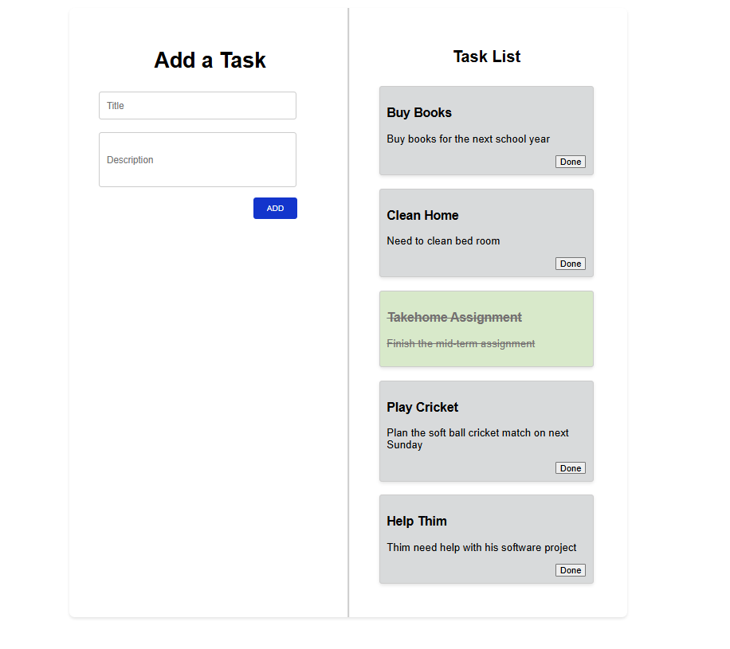

# TODO App

This is a simple TODO application built using React-JavaScript. It allows users to add, view, and mark tasks as completed.



## Features
- Add new tasks with a title and description
- View a list of tasks
- Mark tasks as completed
- Persistent task state using API calls

## Technologies Used
- React-JavaScript
- Axios (for API requests)
- CSS (for styling)

## Prerequisites
Ensure you have the following installed:
- [Node.js](https://nodejs.org/) (version 14 or later)
- [npm](https://www.npmjs.com/) (comes with Node.js)
- [Visual Studio Code](https://code.visualstudio.com/) (recommended for development)

## Getting Started
### 1. Clone the Repository
```sh
git clone https://github.com/ShashiSal98/TODO-App-FE.git
cd todo-app-frontend
```

### 2. Install Dependencies
```sh
npm install
```

### 3. Run the Development Server
```sh
npm start
```
This will start the application at `http://localhost:3000`.

## Project Structure
```
.
├── src
│   ├── components
│   │   ├── TaskForm.js   # Form to add new tasks
│   │   ├── TaskItem.js   # Displays individual tasks
│   │   ├── TaskList.js   # Displays the list of tasks
│   ├── App.js           # Main application file
│   ├── index.js         # React entry point
├── public
│   ├── index.html       # Root HTML file
├── package.json         # Project dependencies and scripts
├── README.md            # Documentation
```

## API Endpoints
Ensure that the backend server is running and supports the following endpoints:
- `GET /task` - Retrieve all tasks
- `POST /task` - Add a new task
- `PATCH /task/{id}/complete` - Mark a task as completed

## Build for Production
To create an optimized production build:
```sh
npm run build
```
This will generate a `build` folder with the compiled application.

## Deployment
You can deploy the application using:
- [Vercel](https://vercel.com/)
- [Netlify](https://www.netlify.com/)
- Any static hosting provider

## License
This project is licensed under the MIT License.

## Author
- [Shashi Salwathura](https://github.com/ShashiSal98)

Happy Coding! 🚀

